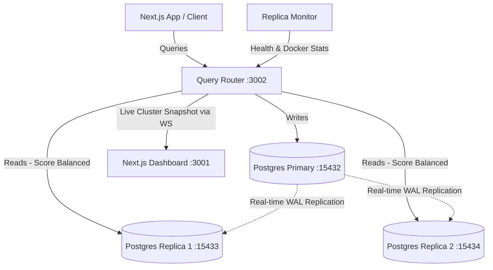

# 🐘 Replic8 – Distributed PostgreSQL Cluster with Intelligent Query Routing

A complete, production-grade local database architecture featuring **PostgreSQL 16 streaming replication**, a custom **Node.js dynamic query router**, and a real-time **Next.js monitoring dashboard**. 

This stack is pre-configured to work out of the box (including on Windows/macOS/Linux) to demonstrate automatic load-balancing, live metrics calculation, and automatic replica failover.

---

## 🎯 The Problem It Solves (The "Why")

### 1. The Scaling Bottleneck
In typical web applications, **read queries** (e.g., fetching user profiles, loading dashboards, generating reports) outnumber **write queries** (e.g., creating accounts, updating orders) by up to 10:1 or more. When a single database server handles both reads and writes:
- Database CPU and memory spike under heavy read load.
- Critical write transactions get queued, slowing down or locking the entire app.

### 2. High Availability & Disaster Recovery
If your single database server crashes, your entire application goes down. 

### 3. How This Project Solves It
This project implements the industry-standard **Primary-Replica** architecture:
*   **The Primary (`postgres-primary`)**: The source of truth. It handles all database writes (`INSERT`, `UPDATE`, `DELETE`, etc.).
*   **The Replicas (`postgres-replica-1`, `postgres-replica-2`)**: Read-only copies that continuously clone the primary database in real-time.
*   **The Query Router (`query-router`)**: A smart proxy that intercepts SQL queries. It automatically parses the SQL:
    *   **Writes** are routed to the Primary.
    *   **Reads** are routed to the most optimal, healthy replica based on live performance metrics (CPU, Memory, Latency, Connections).
*   **Dynamic Failover**: If a replica container crashes, the query router automatically detects this and removes it from the read pool instantly. Read queries continue serving uninterrupted from the remaining healthy replica.

---

## 🏗️ Architecture Overview



---

## 🛠️ Technology Stack

*   **Databases**: PostgreSQL 16 (configured for WAL replication).
*   **Query Router**: Node.js, Express, `pg` (node-postgres), `ws` (WebSockets), `prom-client` (Prometheus metrics).
*   **Monitoring**: Prometheus (scraping router metrics + `postgres-exporter` container instances).
*   **Dashboard**: Next.js, React, TailwindCSS, Chart.js.

---

## ⚡ Quick Start (Replicate the Project)

### Prerequisites
Make sure you have installed:
*   [Docker Desktop](https://www.docker.com/products/docker-desktop/)
*   [Node.js (v18+)](https://nodejs.org/)

---

### Step 1: Clone and Set Up Environment Config
Copy the sample environment file in the root directory:
```powershell
copy .env.example .env
```
Edit `.env` if you want to customize your database names or passwords. By default, it contains pre-configured secure credentials.

---

### Step 2: Spin Up the Docker Stack
Running the following command will build and launch the entire stack:
```powershell
docker compose up -d --build
```
> [!NOTE]
> **Automated Setup**: You do **not** need to manually create the databases or configure replication. The primary database (`postgres-primary`) and both standby read replicas (`postgres-replica-1`, `postgres-replica-2`) are automatically created, configured, and synced with PostgreSQL streaming replication by the Docker Compose startup scripts out of the box.

Verify everything is running correctly:
```powershell
docker compose ps
```
*Expected output: All 7 containers (`postgres-primary`, `postgres-replica-1`, `postgres-replica-2`, `query-router`, `prometheus`, and exporters) are status `running (healthy)`.*

---

### Step 3: Run the Dashboard UI
1. Navigate into the dashboard directory:
   ```powershell
   cd dashboard
   ```
2. Install client dependencies:
   ```powershell
   npm install
   ```
3. Run the Next.js development server:
   ```powershell
   npm run dev
   ```
4. Open [http://localhost:3000](http://localhost:3000) in your browser. You will be greeted with the live system dashboard updating in real-time every 5 seconds.

---

## 🚀 How to Use & Test the Project

### 1. Connecting to the Database Cluster
If you use a GUI like **pgAdmin** or **DBeaver**, you can connect to the nodes individually from your host machine using:
*   **Primary Port**: `127.0.0.1:15432`
*   **Replica 1 Port**: `127.0.0.1:15433`
*   **Replica 2 Port**: `127.0.0.1:15434`
*   *Database Name:* `appdb` (or customized in `.env`)
*   *User:* `postgres`

---

### 2. Testing Case 1: Read/Write Routing Verification
The Query Router listens at `http://localhost:3002/query`. You can send SQL queries via POST requests.

#### A. Execute a Write (Routes to Primary)
```bash
curl -X POST http://localhost:3002/query \
  -H "Content-Type: application/json" \
  -d '{"sql": "INSERT INTO users (name, email) VALUES ('\''Alice'\'', '\''alice@example.com'\'')"}'
```
*Response will show `poolLabel: postgres-primary` (or the currently promoted Primary node).*

#### B. Execute a Read (Routes to best Replica)
```bash
curl -X POST http://localhost:3002/query \
  -H "Content-Type: application/json" \
  -d '{"sql": "SELECT * FROM users"}'
```
*Response will show `poolLabel: postgres-replica-1` or `postgres-replica-2` depending on which one currently has the lower load score.*

---

### 3. Testing Case 2: Primary Node Failover (Zero-Downtime Writes)
To test high-availability failover when the primary node crashes:
1. **Stop the primary container**:
   ```powershell
   docker compose stop postgres-primary
   ```
2. **Observe the Dashboard**:
   - The dashboard dynamically displays `Primary Down` in red.
   - Within seconds, the Query Router automatically identifies the healthiest standby and promotes it.
   - The Activity Log logs `Primary Down` (error) followed by `Replica 1 Promoted` (info) (or Replica 2).
   - The promoted replica's badge shifts to **Primary (Writes Active)**.
3. **Verify Write Routing**:
   - Send another write query:
     ```bash
     curl -X POST http://localhost:3002/query \
       -H "Content-Type: application/json" \
       -d '{"sql": "INSERT INTO users (name, email) VALUES ('\''Bob'\'', '\''bob@example.com'\'')"}'
     ```
   - The write query succeeds immediately with no database connection errors, returning `poolLabel: postgres-replica-1` (or whichever replica was promoted).

---

### 4. Testing Case 3: Old Primary Restoration (Rejoining)
When a crashed primary node comes back online, it should rejoin the cluster as a standby replica of the *new* promoted primary:
1. **Start the old primary container**:
   ```powershell
   docker compose start postgres-primary
   ```
2. **Observe Startup Logs**:
   - Run `docker compose logs -f postgres-primary`.
   - The container checks if another replica is currently the promoted Primary, wipes its local data, executes `pg_basebackup -R` from the new primary (`postgres-replica-1` or `postgres-replica-2`), and starts up as a standby replica streaming WAL logs.
3. **Observe the Dashboard**:
   - The Activity Log logs `Primary Restored` (success) followed by `Rejoining Cluster As Replica` (info).
   - `postgres-primary` status badge turns green with role **Replica**.

---

### 5. Testing Case 4: Standby Replica Failover
To test failover of a read-only replica node:
1. **Stop one replica container**:
   ```powershell
   docker compose stop postgres-replica-2
   ```
2. **Observe the Dashboard**:
   - The status badge for `postgres-replica-2` changes to **Down** (red).
   - Read queries route 100% to the remaining healthy nodes.
3. **Start the replica container**:
   ```powershell
   docker compose start postgres-replica-2
   ```
   - The replica automatically boots up, runs active primary discovery to find the current active primary node, connects to it, and is marked **Healthy** (green) on the dashboard again.

---

### 6. Testing Case 5: Client Reconnection
If you restart the query router (`docker compose restart query-router`), the dashboard UI connection will automatically close and attempt reconnection every 2 seconds. Once the query router is back online, the dashboard re-establishes the connection dynamically without requiring a page refresh.

## 🔄 High Availability & Auto-Failover Logic

Replic8 includes an automated high-availability (HA) database cluster failover and self-healing system:

1. **Failure Detection & Pool Stability**:
   - The Query Router polls node status and executes query latency probes every 5 seconds.
   - If a database container goes down, connection pool errors (`Unexpected error on idle client`) are caught and logged gracefully rather than crashing the Node.js process.
   - If the active primary database is unreachable, the router instantly removes it from the routing pool.

2. **Automated Promotion**:
   - When a primary failure is detected, the Query Router ranks the online replicas using their live scoring metrics.
   - It identifies the healthiest replica and promotes it immediately to the new Primary by running `SELECT pg_promote(false);`.
   - The router dynamically updates the write routing target, shifting all database writes to the newly promoted Primary with zero connection downtime or client-side errors.

3. **Dynamic Rejoining & Streaming Sync**:
   - When a database container starts up, the entrypoint scripts scan the other nodes in the cluster to see if another node has been promoted to Primary (`pg_is_in_recovery() = false`).
   - If an active Primary is found, the rejoining node automatically configures its standby replication target (`PRIMARY_HOST`) to that active primary.
   - If the rejoining node is returning from a promotion (i.e. has no standby signal) but another node is active as Primary, it wipes its local data and triggers a clean `pg_basebackup -R` clone from the active primary, rejoining the cluster as a standby replica.

4. **Real-time Streaming Observability**:
   - All state transitions (e.g. `Primary Down`, `Replica X Promoted`, `Primary Restored`, `Rejoining Cluster As Replica`) are published instantly to the React frontend over a persistent WebSocket connection.
   - The dashboard dynamically visualizes the updated cluster topology map and logs events in the **Cluster Activity Log** with no manual page refresh.

---

## 📊 Live Scoring Formula
Replicas are ranked based on a composite score where **lower is better**.
The score is calculated using real-time system resources and database statistics:

$$\text{Score} = w_{\text{cpu}} \cdot \frac{\text{CPU}\%}{100} + w_{\text{mem}} \cdot \frac{\text{Mem}\%}{100} + w_{\text{conn}} \cdot \frac{\text{Connections}}{\text{PoolMax}} + w_{\text{lat}} \cdot \frac{\text{Latency}}{\text{TargetLatency}} + \text{StalePenalty}$$

*   **Weights** are fully configurable in `.env`.
*   **Stale Nodes** or **Down Nodes** receive an `Infinity` score and are immediately removed from read routing.

---

## ⚙️ Environment Variables & Configuration
You may notice multiple `.env.example` templates in the project:
1. **Root `.env.example`**: Used by Docker Compose to set global database passwords and configuration.
2. **Query Router `.env.example`**: This file is **only** needed if you are running the Node.js application standalone on your host machine (outside of Docker). When running inside Docker Compose, all configuration variables are automatically injected directly via the `environment` section of the `docker-compose.yml` file.

---

## 🔍 Troubleshooting

*   **Dashboard is blank / WebSocket doesn't connect**: 
    Verify that the Query Router Docker stack is running (`docker compose ps`) and that the port mapping for the Query Router (`3002:3000`) is open.
*   **Replicas never become healthy**:
    Check replica logs with `docker compose logs -f postgres-replica-1` to verify replication credentials match the primary `.env`.
*   **Docker Socket Permissions**:
    The router queries `/var/run/docker.sock` to fetch CPU/Memory stats. Ensure your Docker Desktop has socket sharing enabled.