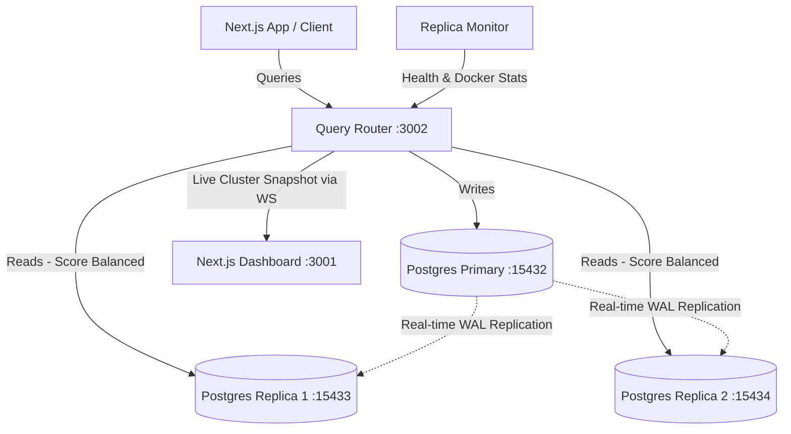

# 🐘 Postgres Replication Cluster & Dynamic Query Router

A complete, production-grade local database architecture featuring **PostgreSQL 16 streaming replication**, a custom **Node.js dynamic query router**, and a real-time **Next.js monitoring dashboard**. 

This stack is pre-configured to work out of the box (including on Windows/macOS/Linux) to demonstrate automatic load-balancing, live metrics calculation, and automatic replica failover.

---

## 🎯 The Problem It Solves (The "Why")

### 1. The Scaling Bottleneck
In typical web applications, **read queries** (e.g., fetching user profiles, loading dashboards, generating reports) outnumber **write queries** (e.g., creating accounts, updating orders) by up to 10:1 or more. When a single database server handles both reads and writes:
- Database CPU and memory spike under heavy read load.
- Critical write transactions get queued, slowing down or locking the entire app.

### 2. High Availability & Disaster Recovery
If your single database server crashes, your entire application goes down. 

### 3. How This Project Solves It
This project implements the industry-standard **Primary-Replica** architecture:
*   **The Primary (`postgres-primary`)**: The source of truth. It handles all database writes (`INSERT`, `UPDATE`, `DELETE`, etc.).
*   **The Replicas (`postgres-replica-1`, `postgres-replica-2`)**: Read-only copies that continuously clone the primary database in real-time.
*   **The Query Router (`query-router`)**: A smart proxy that intercepts SQL queries. It automatically parses the SQL:
    *   **Writes** are routed to the Primary.
    *   **Reads** are routed to the most optimal, healthy replica based on live performance metrics (CPU, Memory, Latency, Connections).
*   **Dynamic Failover**: If a replica container crashes, the query router automatically detects this and removes it from the read pool instantly. Read queries continue serving uninterrupted from the remaining healthy replica.

---

## 🏗️ Architecture Overview



---

## 🛠️ Technology Stack

*   **Databases**: PostgreSQL 16 (configured for WAL replication).
*   **Query Router**: Node.js, Express, `pg` (node-postgres), `ws` (WebSockets), `prom-client` (Prometheus metrics).
*   **Monitoring**: Prometheus (scraping router metrics + `postgres-exporter` container instances).
*   **Dashboard**: Next.js, React, TailwindCSS, Chart.js.

---

## ⚡ Quick Start (Replicate the Project)

### Prerequisites
Make sure you have installed:
*   [Docker Desktop](https://www.docker.com/products/docker-desktop/)
*   [Node.js (v18+)](https://nodejs.org/)

---

### Step 1: Clone and Set Up Environment Config
Copy the sample environment file in the root directory:
```powershell
copy .env.example .env
```
Edit `.env` if you want to customize your database names or passwords. By default, it contains pre-configured secure credentials.

---

### Step 2: Spin Up the Docker Stack
Run the following command to build and launch all database containers, exporters, and the query router:
```powershell
docker compose up -d --build
```
Verify everything is running correctly:
```powershell
docker compose ps
```
*Expected output: All 8 containers (`postgres-primary`, `postgres-replica-1`, `postgres-replica-2`, `query-router`, `query-router-proxy`, `prometheus`, and exporters) are status `running (healthy)`.*

---

### Step 3: Run the Dashboard UI
1. Navigate into the dashboard directory:
   ```powershell
   cd dashboard
   ```
2. Install client dependencies:
   ```powershell
   npm install
   ```
3. Run the Next.js development server:
   ```powershell
   npm run dev
   ```
4. Open [http://localhost:3001](http://localhost:3001) in your browser. You will be greeted with the live system dashboard updating in real-time every 5 seconds.

---

## 🚀 How to Use & Test the Project

### 1. Connecting to the Database Cluster
If you use a GUI like **pgAdmin** or **DBeaver**, you can connect to the nodes individually from your host machine using:
*   **Primary Port**: `127.0.0.1:15432`
*   **Replica 1 Port**: `127.0.0.1:15433`
*   **Replica 2 Port**: `127.0.0.1:15434`
*   *Database Name:* `appdb` (or customized in `.env`)
*   *User:* `postgres`

---

### 2. Testing Read/Write Routing
The Query Router listens at `http://localhost:3002/query`. You can send SQL queries via POST requests.

#### A. Execute a Write (Routes to Primary)
```bash
curl -X POST http://localhost:3002/query \
  -H "Content-Type: application/json" \
  -d '{"sql": "INSERT INTO users (name, email) VALUES ('\''Alice'\'', '\''alice@example.com'\'')"}'
```
*Response will show `poolLabel: primary`.*

#### B. Execute a Read (Routes to best Replica)
```bash
curl -X POST http://localhost:3002/query \
  -H "Content-Type: application/json" \
  -d '{"sql": "SELECT * FROM users"}'
```
*Response will show `poolLabel: postgres-replica-1` or `postgres-replica-2` depending on which one currently has the lower load score.*

---

### 3. Testing Dynamic Failover (Killing a Node)
This is where you can see the dynamic updates in action:
1. **Stop one replica container**:
   ```powershell
   docker compose stop postgres-replica-1
   ```
2. **Observe the Dashboard**:
   - Within **2 seconds**, `postgres-replica-1`'s status pill changes to **Down** (red).
   - Its load metrics (CPU, Memory, Connections, and Latency) instantly reset to **0**.
   - The cluster system-wide averages recalculate using only the remaining **active** replica (`postgres-replica-2`), preventing the offline node's metrics from corrupting system-wide averages.
3. **Execute Reads**:
   - Run more read queries through `http://localhost:3002/query`. You will notice that 100% of read queries now route to `postgres-replica-2`. No queries fail!
4. **Bring the Replica Back Online**:
   ```powershell
   docker compose start postgres-replica-1
   ```
   *Within seconds, the health monitor detects the container is back up. The status pill changes back to **Healthy** (green) and queries begin distributing across both replicas once again.*

---

### 4. Testing Client Reconnection
If you restart the query router (`docker compose restart query-router`), the dashboard UI connection will automatically close and attempt reconnection every 2 seconds. Once the query router is back online, the dashboard re-establishes the connection dynamically without requiring a page refresh.

---

## 📊 Live Scoring Formula
Replicas are ranked based on a composite score where **lower is better**.
The score is calculated using real-time system resources and database statistics:

$$\text{Score} = w_{\text{cpu}} \cdot \frac{\text{CPU}\%}{100} + w_{\text{mem}} \cdot \frac{\text{Mem}\%}{100} + w_{\text{conn}} \cdot \frac{\text{Connections}}{\text{PoolMax}} + w_{\text{lat}} \cdot \frac{\text{Latency}}{\text{TargetLatency}} + \text{StalePenalty}$$

*   **Weights** are fully configurable in `.env`.
*   **Stale Nodes** or **Down Nodes** receive an `Infinity` score and are immediately removed from read routing.

---

## 🔍 Troubleshooting

*   **Dashboard is blank / WebSocket doesn't connect**: 
    Verify that the Query Router Docker stack is running (`docker compose ps`) and that the port mapping for Caddy/proxy (`3002:3002`) is open.
*   **Replicas never become healthy**:
    Check replica logs with `docker compose logs -f postgres-replica-1` to verify replication credentials match the primary `.env`.
*   **Docker Socket Permissions**:
    The router queries `/var/run/docker.sock` to fetch CPU/Memory stats. Ensure your Docker Desktop has socket sharing enabled.