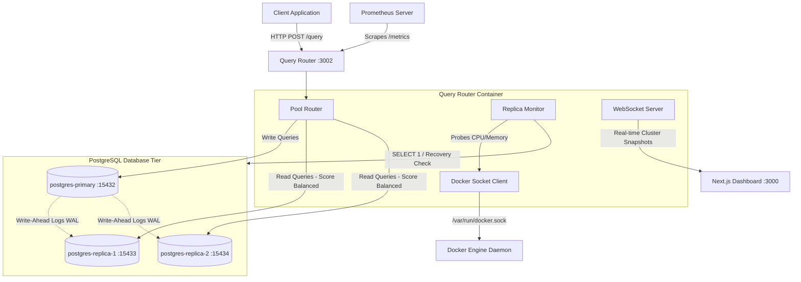

# Replic8: Distributed PostgreSQL Cluster with Intelligent Query Routing
## Comprehensive System Architecture & Engineering Guide

This document provides a highly detailed, file-by-file, module-by-module architectural breakdown of **Replic8**. It covers the design decisions, algorithms, recovery mechanics, and networking details, serving as a comprehensive reference guide to understand the system years down the road.

---

## 1. High-Level System Architecture

Replic8 is a high-availability database cluster that decouples read and write database traffic. It combines PostgreSQL streaming replication with a lightweight query routing proxy and a real-time React visualization dashboard.



---

## 2. PostgreSQL Streaming Replication (The Storage Tier)

Replic8 uses physical streaming replication. Instead of copying SQL statements, the primary node streams binary changes (Write-Ahead Logs - WAL) to standby nodes.

### Replicating from scratch
1.  **Primary Initialization**: When `postgres-primary` starts, it creates a database named `appdb` and a dedicated user named `replicator` with `REPLICATION` permissions.
2.  **Base Backup**: When a replica container starts up with an empty data folder, it uses the `pg_basebackup` utility to stream a full binary snapshot of the primary's data directory.
3.  **Standby Configuration**: The `-R` flag passed to `pg_basebackup` automatically writes:
    *   A `standby.signal` file (which tells Postgres to boot in read-only standby mode).
    *   A `postgresql.auto.conf` file containing the connection string to the primary database (`primary_conninfo`).

### Cascaded Replication & Standing timelines
When replicas are promoted, they switch database timelines (e.g. from timeline 1 to timeline 2). Any remaining standby nodes must follow the new timeline. PostgreSQL automatically handles timeline switching if the standby can fetch the new timeline history file (`.history`) from the new primary.

---

## 3. Query Router Core Modules & Routing Pipeline

The Query Router is implemented in Node.js and sits between your application and the database tier. It acts as an intelligent proxy.

### A. Pool Configuration (`src/config/pools.js`)
The router maintains distinct database client pools using `node-postgres` (`pg.Pool`).
*   **Idle Client Error Handling**: A crucial reliability mechanism is the `pool.on('error')` listener. When a database node crashes, any connection in the pool becomes broken. Without this handler, Node.js throws an unhandled exception and crashes the process. Registering this event intercepts the socket termination and prevents process termination.
*   **Timeouts**: Enforces a `query_timeout` (2 seconds) and `connectionTimeoutMillis` (5 seconds) to ensure that if a node locks up, queries fail fast and trigger failover routing rather than hanging the web request.

### B. Request Parsing & Classification (`src/routing/poolRouter.js`)
When the router receives an SQL statement via `POST /query`:
1.  **Write Detection**: It inspects the SQL query using a regex check. If the query starts with words like `INSERT`, `UPDATE`, `DELETE`, `CREATE`, `DROP`, `ALTER`, `BEGIN`, or `COMMIT`, it is classified as a **Write**.
2.  **Read Detection**: If the query is a `SELECT`, it is classified as a **Read**.
3.  **Routing**:
    *   **Writes** go to the active `Primary` pool. If no primary is online, the query router throws an error.
    *   **Reads** are routed to the read replica that currently has the **lowest performance load score**. If all replicas are down, it falls back to routing reads to the active Primary to ensure system availability.

### C. Live Latency Tracking
When a read query successfully executes on a replica, the query router calculates the time taken. It updates that replica's average query latency using an **Exponentially Weighted Moving Average (EWMA)**:
$$\text{AverageLatency}_{\text{new}} = (\text{AverageLatency}_{\text{old}} \cdot 0.8) + (\text{CurrentQueryTime} \cdot 0.2)$$
This ensures the scoring engine reacts to traffic load spikes in real time.

---

## 4. Load Balancing & Performance Scoring Algorithm

The Query Router does not use simple Round-Robin. It dynamically routes reads using a weighted scoring formula where **lower is better**.

### The Formula
Every 5 seconds, the `ReplicaMonitor` queries container resource stats and database connection metrics. It computes a score for each replica:

$$\text{Score} = w_{\text{cpu}} \cdot \frac{\text{CPU}\%}{100} + w_{\text{mem}} \cdot \frac{\text{Mem}\%}{100} + w_{\text{conn}} \cdot \frac{\text{Connections}}{\text{PoolMax}} + w_{\text{lat}} \cdot \frac{\text{Latency}}{\text{TargetLatency}} + \text{StalePenalty}$$

### Parameter Metrics & Weights
*   **CPU Weight ($w_{\text{cpu}}$ = 0.30)**: Normalizes CPU percentage to a decimal between `0` and `1`.
*   **Memory Weight ($w_{\text{mem}}$ = 0.25)**: Normalizes container RAM usage to a decimal between `0` and `1`.
*   **Connections Weight ($w_{\text{conn}}$ = 0.20)**: Measures active client sessions against the configured maximum pool size limit.
*   **Latency Weight ($w_{\text{lat}}$ = 0.25)**: Compares average latency against a `TargetLatency` threshold (default 200ms).
*   **Stale Penalty**: If a replica fails to return updated stats within the `staleReplicaThresholdMs` (default 15 seconds), it is penalized with a high score to deprioritize it behind healthy nodes.
*   **Down Nodes**: Receive a score of `Infinity` and are immediately excluded from routing.
*   **Primary Node**: Receives a score of `Infinity` for read queries (unless fallback is active) to keep it dedicated to write traffic.

---

## 5. High Availability, Failover & Self-Healing Mechanics

This is the core reliability loop of Replic8. It manages container failures, master promotion, and standby re-synchronization.

```
                  +--------------------------------+
                  |  Primary database goes offline  |
                  +----------------+---------------+
                                   |
                                   v
                  +--------------------------------+
                  | Monitor pings fail, logs error |
                  |    and triggers "Primary Down"  |
                  +----------------+---------------+
                                   |
                                   v
                  +--------------------------------+
                  |  Evaluates replica scores and  |
                  | selects the healthiest standby |
                  +----------------+---------------+
                                   |
                                   v
                  +--------------------------------+
                  | Router sends SELECT pg_promote |
                  |     to the selected replica    |
                  +----------------+---------------+
                                   |
                                   v
                  +--------------------------------+
                  |  Standby promoted to Primary   |
                  | Writes route to new Primary    |
                  +----------------+---------------+
                                   |
                                   v
                  +--------------------------------+
                  |    Old Primary returns online  |
                  +----------------+---------------+
                                   |
                                   v
                  +--------------------------------+
                  | Startup script checks cluster, |
                  |  finds new Primary, wipes database|
                  |  and runs pg_basebackup sync   |
                  +----------------+---------------+
                                   |
                                   v
                  +--------------------------------+
                  | Old Primary rejoins standby    |
                  |     and streams WAL logs       |
                  +--------------------------------+
```

### A. Failure Detection
The monitor checks node health every 5 seconds. A node is marked `Down` if:
*   Its container is stopped or missing.
*   Its connection pool throws connection errors.
*   A query probe (`SELECT 1`) fails or times out.

### B. Failover Execution
If the active primary database goes offline:
1.  **Grace Period Verification**: The router checks if the cluster has been running longer than the startup grace period (default 15 seconds) to prevent false promotions during initial container boot.
2.  **Replica Ranking**: The monitor filters the online, healthy replicas and sorts them by their current performance score.
3.  **Master Promotion**: The router sends a `SELECT pg_promote(false)` query config with an extended timeout (30 seconds) to the selected standby replica. The `false` parameter runs the promotion in non-blocking mode, preventing client query hang-ups during checkpoints.
4.  **State Shift**: Once promoted, the replica exits read-only standby mode, writes its own timeline file, and begins accepting write transactions. The query router dynamically updates the write target pool to point to this container.

### C. Self-Healing & Dynamic Rejoining
When the old primary or any stopped replica is started back up, it must not return as an active master (split-brain condition). It runs the following rejoining protocol:
1.  **Cluster Discovery**: The container's startup entrypoint script loops through the other database nodes in the cluster (`postgres-primary`, `postgres-replica-1`, `postgres-replica-2`).
2.  **Role Evaluation**: For each node, it uses `psql` to check if `pg_is_in_recovery()` returns `false` (meaning that container is running as a writeable Primary database).
3.  **Sync Trigger**:
    *   If it finds an active primary (e.g. `postgres-replica-1` was promoted), it updates its replication target (`PRIMARY_HOST`).
    *   If it was previously running as a Primary (i.e. has no `standby.signal`), but another node is active in the cluster, it **wipes its local data directory** (`rm -rf $PGDATA/*`).
    *   It executes `pg_basebackup -R` to replicate the clean database state from the active primary, writes the standby config, and starts up as a standby replica.

---

## 6. Real-time Observability Protocol (WebSockets)

Instead of the dashboard client constantly polling the HTTP server for status updates, Replic8 uses a push-based WebSocket design:

1.  **Connection**: The Next.js dashboard client opens a persistent connection to the Query Router at `ws://localhost:3002/ws/cluster`.
2.  **Initial State**: Upon connection, the router immediately serializes and pushes the current cluster snapshot (node health, CPU, Memory, lag, and historical alerts log).
3.  **Broadcast**: In `src/monitoring/replicaMonitor.js`, whenever a state change occurs (a node goes down, a replica is promoted, or metrics are refreshed), the monitor calls `emitChange()`.
4.  **Push Notification**: The server receives the event and broadcasts the JSON snapshot to all connected browser clients. This triggers React state updates, dynamically redrawing charts and updating topology cards in under 100 milliseconds without refreshing the browser tab.

---

## 7. System Limitations & Technical Trade-offs

When discussing this architecture, it is important to understand its constraints:

### A. Replication Lag & Read-After-Write Consistency
Because replication is asynchronous, a write query executed on the primary takes a few milliseconds to stream and apply to the read standbys.
*   **The Risk**: If an application writes a record (e.g. creating a comment) and immediately sends a read query to fetch it, the read query might route to a replica that has not yet received the WAL record, resulting in "missing" data for the user.
*   **The Trade-off**: Replic8 prioritizes high read scalability and primary write performance over strict read-after-write consistency. For workloads requiring immediate consistency (e.g., viewing a checkout confirmation), queries can be explicitly forced to run on the primary by wrapping them in SQL transactions (`BEGIN ... COMMIT`) or configuring the router to bypass replicas for specific routes.

### B. Split-Brain Mitigation
In network partitions, a replica might think the primary is dead and promote itself, while the primary is still alive and accepting writes from a segment of the network.
*   **Replic8 Mitigation**: The query router acts as the centralized coordinator (oracle). Since clients query the database *through* the router, the router's view of the primary is what determines promotion. If the primary is unreachable from the query router, it is dead to the application, making the promotion of a replica safe.

### C. Docker Socket Exposure
The query router mounts `/var/run/docker.sock` to query container CPU and RAM usage.
*   **Security Trade-off**: Exposing the Docker socket inside a container gives that container root-level control over the host Docker daemon. In production, this can be avoided by querying metrics from an orchestrator API (like Kubernetes metrics APIs or AWS CloudWatch) rather than exposing the raw Docker socket to the application layer.

---

## 8. Summary of Source Code Directory

*   [docker-compose.yml](file:///c:/Users/freeb/Desktop/NewProj/docker-compose.yml): Coordinates container images, networks (`pg-cluster`, `public`), and exposes `3002:3000` (Query Router) and `9090` (Prometheus) to the host.
*   [docker/postgres/primary/entrypoint.sh](file:///c:/Users/freeb/Desktop/NewProj/docker/postgres/primary/entrypoint.sh): Entrypoint for `postgres-primary`. Handles master DB initialization or auto-wipe and rejoining if a promoted primary replica is active in the cluster.
*   [docker/postgres/replica/entrypoint.sh](file:///c:/Users/freeb/Desktop/NewProj/docker/postgres/replica/entrypoint.sh): Entrypoint for replicas. Performs dynamic active primary discovery, automatically running `pg_basebackup -R` standbys on startup.
*   [query-router/src/server.js](file:///c:/Users/freeb/Desktop/NewProj/query-router/src/server.js): Starts Express API server, WebSocket server, and initializes the cluster monitor.
*   [query-router/src/monitoring/replicaMonitor.js](file:///c:/Users/freeb/Desktop/NewProj/query-router/src/monitoring/replicaMonitor.js): The core loop that polls nodes, resolves active database roles, computes load-balancing scores, handles primary failures, and runs master promotions.
*   [query-router/src/config/pools.js](file:///c:/Users/freeb/Desktop/NewProj/query-router/src/config/pools.js): Allocates connection pools, sets query timeouts, and implements the pool error catcher.
*   [query-router/src/routing/poolRouter.js](file:///c:/Users/freeb/Desktop/NewProj/query-router/src/routing/poolRouter.js): Parses SQL statements into reads/writes and routes them to the best database pool.
*   [dashboard/lib/hooks/use-realtime-metrics.js](file:///c:/Users/freeb/Desktop/NewProj/dashboard/lib/hooks/use-realtime-metrics.js): React hook that opens a persistent WebSocket connection to port `3002` and handles real-time state broadcasts.
